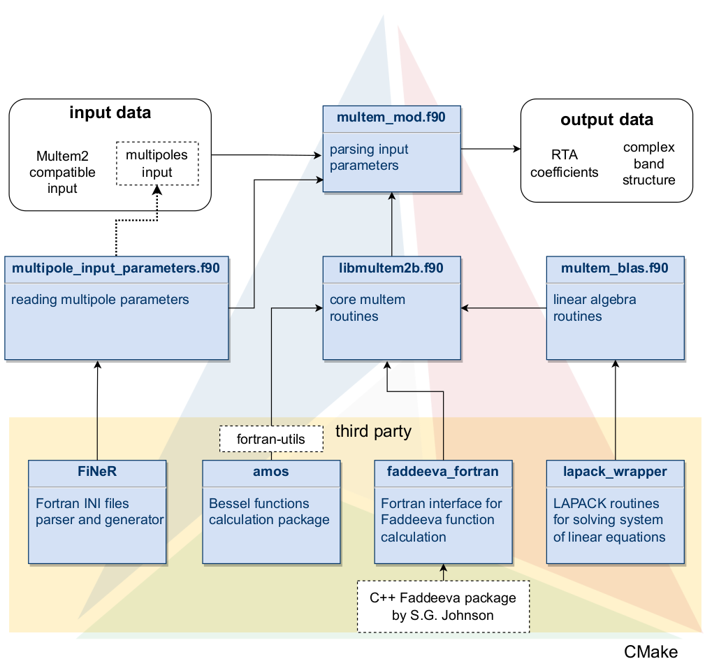

# Multem 3 

Multem 3 is a renewed program for transmission and band-structure calculations of photonic crystals using multiple-scattering theory for 2D periodic systems and a layer-by-layer coupling scheme.

## Project description
Multem is an open source program for calculation of the transmission, reflection and absorption coefficients, and complex band structure of a photonic crystal slab. We present the renewed version of Multem called Multem 3. 

**Main changes**:
* Its  syntax has been upgraded to Fortran 2018, with the source code being divided into modules. 
* Multem 3 is equipped with LAPACK, the state-of-the art Faddeeva complex error function routine, and the Bessel function package AMOS. 
* It is allowed to freely increase the cut-off value LMAX on the number of spherical vector wave functions and the cut-off value RMAX controlling the maximal length of reciprocal vectors taken into consideration.

### Project structure



folder fig


## How to install and run the project
Install the project
```
git clone --recurse-submodule https://github.com/ArtyomShalev/Multem-3.git
```

### Prerequisites
* gcc and gfortran
* CMake
* LAPACK

### Building the project 
```
cd Multem-3
cmake .
make 
```

### Runnig the project
Multem3 can be run by the python script in simulation directory.
```
cd simulation
python3 start_simulation.py
```
This script generates all necessary config files using the self-written python module which is located at src/python_simulations directory.

**Configuration files description**

* **fort.10** is a Multem1 and Mutlem2 compitable input file. It sets up the incident field, the design of the structure by planes, the material parameters of the spheres in each plane etc. More detailed information about this config file can be found in original Multem paper (1998) (see *Publications* section) 

* **multipole_regime_parameters.ini** is a multipole decomposition configuration file. It is devided into two sections -- selectors and regime. *Selectors* are used for turning the multipole decomposition on and off. *Regime* is used for setting the [specific multipole (s - type, n - order and m - projection) indices](https://en.wikipedia.org/wiki/Vector_spherical_harmonics#Alternative_definition). If the corresponsing selector is off (equals to 0) then regime will not be read by the program, and can be arbitrary. 

## How to use Multem 3 (to be added soon)

2D systems

Photonic crystal slabs


## License

[MIT](https://choosealicense.com/licenses/mit/)

## Publications

When using this code please cite 

[Multem 3: An updated and revised version of the program for transmission and band calculations of photonic crystals]

Other relevant publications are:

[N. Stefanou, V. Yannopapas, A. Modinos,
MULTEM 2: A new version of the program for transmission and band-structure calculations of photonic crystals,
Computer Physics Communications,
Volume 132, Issues 1–2,
2000,
Pages 189-196,
ISSN 0010-4655](https://doi.org/10.1016/S0010-4655(00)00131-4)

[N. Stefanou, V. Yannopapas, A. Modinos,
Heterostructures of photonic crystals: frequency bands and transmission coefficients,
Computer Physics Communications,
Volume 113, Issue 1,
1998,
Pages 49-77,
ISSN 0010-4655](https://doi.org/10.1016/S0010-4655(98)00060-5)

[J. Pendry, Low Energy Electron Diffraction: The Theory and its Application to
Determination of Surface Structure, Techniques of Physics, Academic Press, 1974](https://scripts.iucr.org/cgi-bin/paper?S0021889875010886)

## Contibutors

## TODOs 
    change the gitmodules
    where all binaries are
    what is fort.1 fort.8 fort.10 fort.16 and .ini is
    how to run Multem-3
    how to make a config
    frequently used setups

    